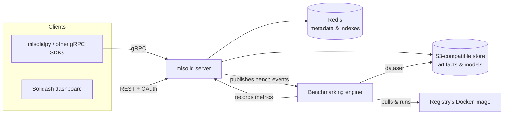

<div align="center">


<a name="readme-top"></a>

# The MLSolid Platform

A solid & sane MLOps platform. It makes it possible to **R&D**, **benchmark**, and **deploy** your models with ease. Its simple architecture allows for easy deployment and a variety of language support (not just Python)!

[](https://github.com/zeddo123/mlsolid/actions/workflows/docker-publish.yaml)
[](https://github.com/zeddo123/mlsolid/actions/workflows/build.yaml)
[](https://github.com/zeddo123/mlsolid/actions/workflows/lint.yaml)
[](https://github.com/zeddo123/mlsolid/actions/workflows/buf-ci.yaml)
[](https://github.com/zeddo123/mlsolid/actions/workflows/buf-lint.yaml)
[](https://goreportcard.com/report/github.com/zeddo123/mlsolid)


</div>

# 🔬 mlsolid

mlsolid is a solid alternative to MLflow, written in Go, with Redis as its metadata backend and any S3-compatible bucket as its artifact store.

The project is split into three parts:

* **`mlsolid`** (this repo) — the server: a gRPC API for clients, a REST API for the dashboard, and a Docker-based benchmarking engine.
* **[`mlsolidpy`](https://github.com/zeddo123/mlsolidpy)** — the official Python client.
* **[`solidash`](https://github.com/zeddo123/solidash)** — a web dashboard for browsing experiments, registries, and benchmarks.

mlsolid addresses my issues with MLflow by being:

0. **fast** — Redis-backed metadata with sorted-set indexes for stable, cursor-based pagination even at scale.
1. **production focused, and easy to deploy** — a single Go binary plus Redis and an S3-compatible bucket, no JVM/Python server stack to babysit.
2. **a dumb client** — the client only sends experiments, metrics, and artifacts; there's no business logic to keep in sync between server and SDK versions.
3. **documented without drowning you in options** — no 1000+ config knobs with near-identical names.

As a design decision, mlsolid is solely responsible for saving artifacts to the object store, as opposed to MLflow, which by default does not work in "proxied artifact storage" mode (particularly hard to set up). This keeps S3 credentials off the client entirely and means data scientists barely need to configure anything on their side.

Clients talk to mlsolid over `gRPC`, which is what makes multi-language support possible — not just Python. Pre-generated gRPC SDKs for several languages are available via `buf.build` [here](https://buf.build/zeddo123/mlsolid/sdks).

## ✨ Features

* 🧪 **Experiment tracking** — log runs, scalar and multi-value metrics, and artifacts (plaintext files, checkpoints, arbitrary files) against named experiments.
* 📦 **Model registry with versioning** — register models per run, tag versions (`latest`, `prod`, ...), and stream models back down efficiently over gRPC.
* 🐳 **Automated benchmarking** — attach a Docker image to a registry (with optional GPU passthrough); new model versions are automatically run against a dataset (local, HTTP, or S3), scored, and recorded.
* 🏆 **Best-model selection** — query the top run across a benchmark by one or more metrics, over gRPC or REST (`GET /v1/benchmark/:id/best?metrics=...`), and optionally auto-tag the winner.
* 🔐 **Authentication** — Google OAuth (domain-restricted) for the dashboard, plus API keys for machine clients; either can be required or disabled independently.
* 🌍 **Polyglot clients** — a single gRPC service definition, with SDKs generated for multiple languages via `buf.build` — Python is just the reference client.
* 📊 **REST API + dashboard** — an OpenAPI-documented REST surface (`openapi-spec.yaml`) powering the Solidash web dashboard.
* 🔒 **Optional gRPC TLS** — bring your own certs, or generate dev ones with `make certs`.

## 🏗️ Architecture



Runs and their metrics/artifacts, model registries, and benchmarks are indexed in Redis using sorted sets for stable, O(log n) pagination. All binary payloads — artifacts, checkpoints, benchmark datasets — live in S3-compatible object storage; mlsolid is the only thing that ever holds the S3 credentials.

## Overview

### 🌟 Solidash dashboard

[Solidash](https://github.com/zeddo123/solidash) is the web dashboard for mlsolid. It's a separate frontend app that talks exclusively to the server's REST API (`/v1/*`) — it has no direct access to Redis or S3, and reflects exactly what any other REST client could see.

Backed by that API, the dashboard lets you:

* **Browse experiments and runs** — list experiments, drill into a run's metrics and artifacts, and download individual artifacts by run + name.
* **Explore metrics** — view a run's logged metrics (scalar and multi-value/time-series) without needing gRPC tooling.
* **Manage model registries** — list registries, inspect a registry's versioned model entries and tags, and create new registries.
* **Manage benchmarks** — create, pause/resume (toggle), edit, and delete benchmarks; inspect a benchmark's run history; and pull the best-performing run across a benchmark by one or more metrics.
* **Issue API keys** — authenticated users can mint API keys for machine clients from the dashboard, without touching the server directly.

Authentication is Google OAuth (`/login/:provider` → `/auth/callback/:provider`), gated by `google_allowed_domains`. On success the server sets an `HttpOnly`, `SameSite=Lax` session cookie; the API's CORS policy is locked to a single origin (`frontend_url`) with credentials enabled, which combined with the cookie policy is the app's CSRF defense — there's no separate CSRF token to manage.

To run Solidash against your own server, point it at the server's `root_url` and set the server's `frontend_url` to wherever Solidash is hosted (see [Configuration](#️-configuration)) — the two must match for OAuth redirects and CORS to work.


### 🐍 Python client example
Here are some basic examples using our Python client to track your experiments:
```Python
from mlsolidpy.mlsolid import Mlsolid

client = Mlsolid('localhost:5000')

print('Experiments', client.experiments)

print('Run ', client.run("urbane-wagon"))

with client.start_run('my_experiment') as run:
    run.log({'checkpoint': "path/to/checkpoint"})
    run.log({'batch-size': 23})

    run.log({'mae': 0.2333, 'loss': 100.0})
    run.log({'mae': 0.2000, 'loss': 90})
    run.log({'mae': 0.1134, 'loss': 10})
    run.log({'metrics': [0.2000, 0.333, 0.2223]})
```

And here is a basic example on how to use `mlsolid` to push models and artifacts:
```Python

from mlsolidpy.mlsolid import Mlsolid

client = Mlsolid('localhost:5000')

# create a new model registry to version your model
created = client.create_model_registry('test_registry_1')

run_id = None

with client.start_run('my_experiment') as run:
    run_id = run.run_id

    # you can attach a plain text file artifact (logs, etc) to your run:
    run.add_plaintext_artifact('./tests/data/plain_text_file.txt')

    # You can add a model artifact to your run:
    run.add_model('./tests/data/mobile_sam.pt')

# After adding and uploading your model artifact linked to your run, you can
# attach it to your model registry with the name of the registry (test_registry_1 in our example)
# and the run_id and name of the artifact. You can also add a list of tags, to allow
# easier access to your model.
added = client.add_model('test_registry_1', run_id, 'mobile_sam.pt', ['latest'])

# You can easily download your model,
# by simply providing the model registry name and a valid tag.
client.tagged_model('test_registry_1', 'latest')

# You can also access any of your artifacts by providing the run_id and their name
client.artifact(run_id, 'plain_text_file.txt')
```

## 🚀 Quickstart

The fastest way to get a local mlsolid server running is via Docker Compose, which spins up Redis alongside the server:

```bash
git clone https://github.com/zeddo123/mlsolid.git
cd mlsolid

touch mlsolid.yaml

docker compose up --build
```

By default the gRPC API listens on `5000` (mapped by `docker-compose.yml`) and the REST/dashboard API on `8050` — expose `8050` too if you're running Solidash locally. You'll need an S3-compatible bucket (AWS S3, MinIO, etc.) reachable from the container; Redis is provisioned for you by Compose.

Once it's up, point `mlsolidpy` at `localhost:5000` as shown in the examples above.

## ⚙️ Configuration

Configuration happens through a `yaml` file located either next to the binary at `./mlsolid.yaml` or at `/etc/mlsolid/mlsolid.yaml`. Any key can also be set via an equivalent environment variable.

```yaml
root_url: "https://mlsolid_service_url"
frontend_url: "https://solidash_url"
prod: true

api_key_access: false # Sets if API Keys are checked when communicating with the grpc endpoints.
google_client_id: "***"
google_secret_id: "***"
google_allowed_domains: "your-org.xyz"

api_port: 8050
grpc_port: 5000
grpc_ssl: false # Set to true to terminate TLS on the gRPC endpoint (see `make certs` for dev certs)
grpc_cert_path: "./certs/service.pem"
grpc_key_path: "./certs/service.key"

redis_addr: redis:6379
redis_password: ""
redis_db: 0

s3_endpoint: ""
s3_key: ""
s3_secret: ""
s3_bucket: ""
s3_region: ""
s3_prefix: "artifacts" # key prefix under which artifacts are stored in the bucket

# Configuration related to benchmarking
enable_bengine: false # used to enable/disable benchmarking engine
docker_registry_username: "***"
docker_registry_password: "***"

# host's source volume used when mlsolid is running in a container
# and needs to bind datasets & checkpoints volumes to runner
host_source_volume: ""
```

## 🛠️ CLI tools

Two small standalone tools live under `cmd/`, useful during development:

* `cmd/populate` — seeds a running mlsolid server with fake experiments, runs, metrics, and registries, for quickly exercising the dashboard.
* `cmd/stress` — a concurrent load-testing tool that hammers the gRPC API with a configurable worker pool.

## 🔗 Ecosystem

* [`mlsolidpy`](https://github.com/zeddo123/mlsolidpy) — the Python client.
* [`solidash`](https://github.com/zeddo123/solidash) — the web dashboard.
* [gRPC SDKs on buf.build](https://buf.build/zeddo123/mlsolid/sdks) — pre-generated clients for other languages.

## 📄 License

mlsolid is licensed under the [GNU GPLv3](./LICENSE).
